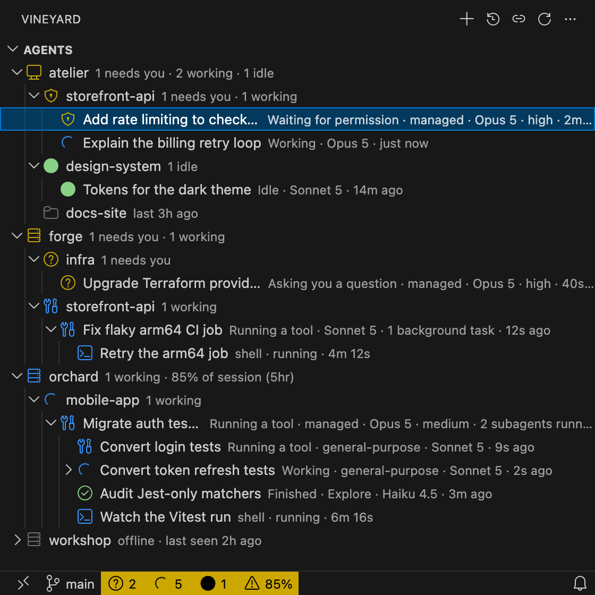
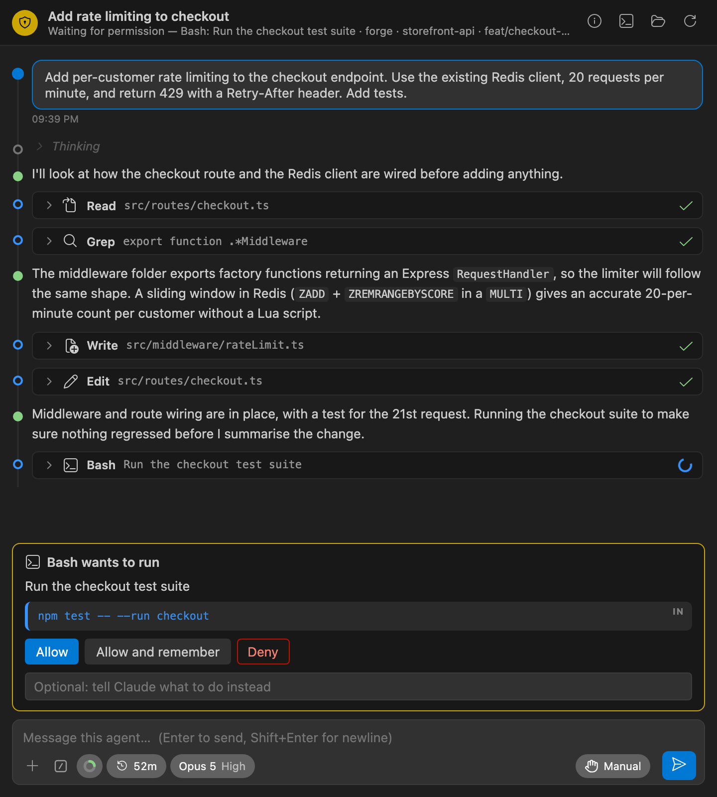
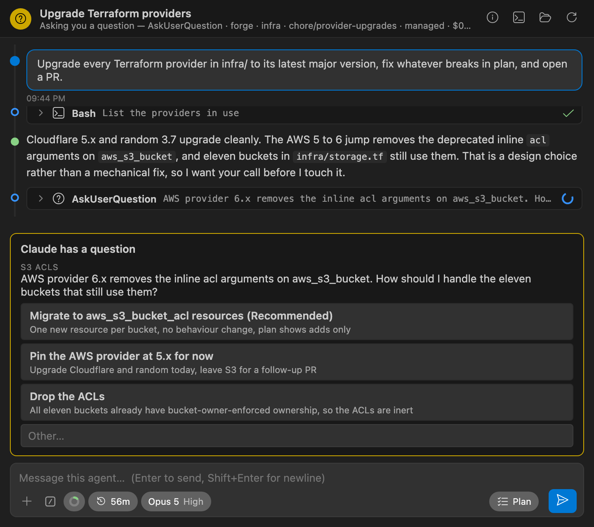
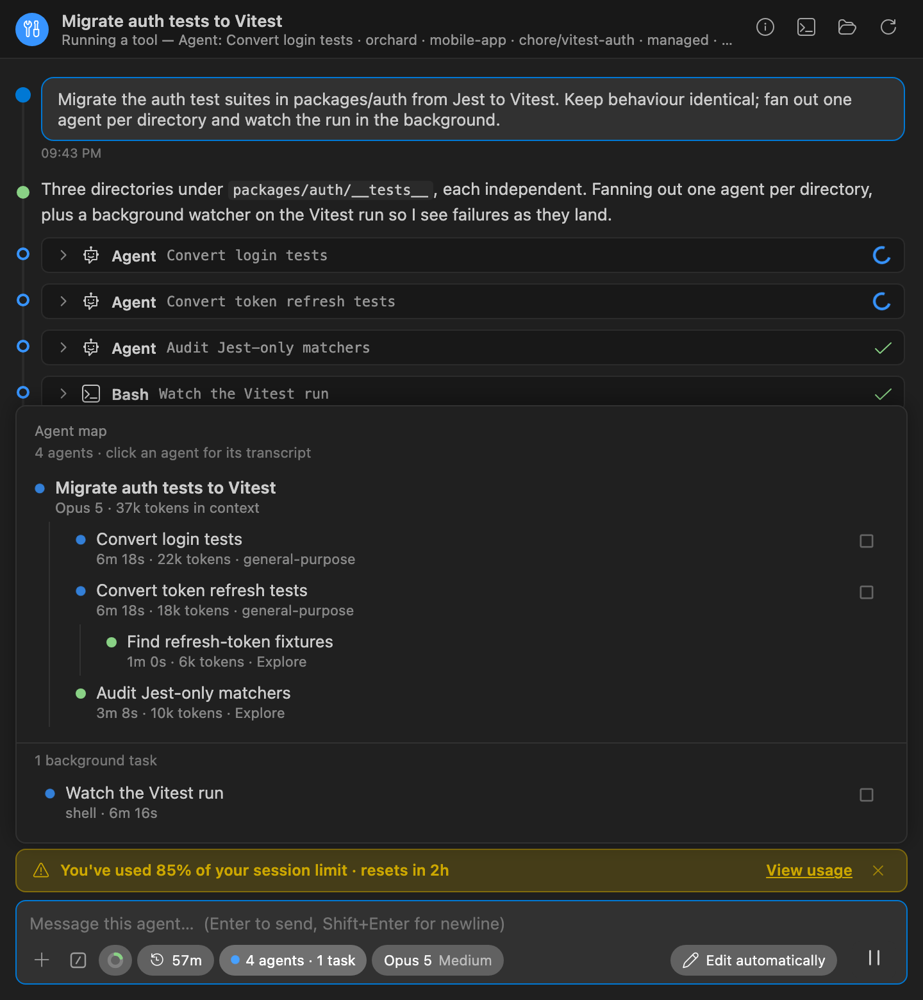

# Vineyard

**Every Claude Code agent, on every machine you own, in one VS Code window.**

Vineyard runs a tiny daemon on each of your machines and shows all of their Claude Code sessions in one
tree: what each agent is doing right now, which ones are waiting on you, and what they are working on.
Open any agent's conversation, answer its permission prompt or question from wherever you happen to be
sitting, start new agents on other machines, and put the whole fleet to work without leaving your editor.

## Run a fleet, not a window

* **One tree for everything.** Machines › workspaces › agents › subagents › background tasks, each
  with its live state: working, thinking, running a tool, asking you a question, waiting for
  permission, idle. Model, effort, context size, branch, uptime and the last prompt are a hover away.
* **Know who needs you.** A machine row rolls its agents up ("1 needs you · 2 working"), the status
  bar counts the whole fleet, and an optional notification fires when an agent asks a question, wants a
  permission, or finishes while you were elsewhere. Sort any tier attention-first and the agents that
  need you rise to the top and stay put.
* **Subagents, nested to any depth.** Every Agent-tool invocation Claude Code spawns sits under its
  parent with its own state, model and running time, and opens its own read-only transcript. Shell
  commands left running in the background appear beside them.
* **Sleeping machines are woken** with Wake-on-LAN when you look at them, a watched Mac is kept awake
  so its agents do not stall, and a machine you cannot reach shows its last-known state.
* **Usage limits across the fleet.** The fullest account limit shows on the machine row and in the
  status bar, so you see a session window filling up before an agent hits it.

## Answer from wherever you are

* **Permission prompts, questions, plan reviews and MCP elicitations** arrive as cards in the chat and
  are answered there, with the same choices the Claude Code pane offers: allow once or remember the
  rule, pick an option or type your own, approve a plan or send it back with feedback.
* **Any running agent takes messages**, including ones started in the Claude Code pane or a terminal.
  Attach images and files; they travel to the agent's machine with the prompt.
* **Take over a session** that was started elsewhere when it needs an answer only Vineyard can give.
  The daemon on that machine ends the process and resumes the same session as its own child; a
  pending question survives the switch and is asked again in the chat.

## Start, resume, hand over, stop

* **New Agent Here…** in any workspace on any machine. It starts with the model, effort and permission
  mode you last used in that workspace, and the pickers in the chat change the running session in place.
* **Resume a Past Session…** from the transcripts on any machine, newest first, with title, first and
  last prompt, model and branch. Or resume it in a terminal on that machine.
* **Pause** a turn mid-flight, **Stop** a session cleanly, or **Terminate** one you did not start. The
  transcript stays on disk either way.
* **Sign In to Claude on Machine…** when a remote machine's login expires: the daemon runs the sign-in
  there, Vineyard opens the URL in your browser and passes the code back.
* **Rename** a session by clicking its title; Claude Code shows the new name too.

## A chat that keeps up with Claude Code

* **The same toolbar as the pane**: attach, a filterable **/** menu with every slash command the
  session offers, a context-window donut (click to compact), a prompt-cache clock counting down to
  expiry, and pills for model, reasoning effort and permission mode.
* **An agent map** of every subagent and background command with state, running time and tokens.
  Each row opens its transcript; each running row has a **Stop** button.
* **A transcript built for long sessions**: the current prompt stays pinned while you scroll, thinking
  is collapsed, tool calls fold to one line with IN/OUT blocks for shell commands, and an activity
  ticker shows what the agent is doing while it is busy.
* **Account & usage** in the / menu, with a bar per limit window, and a dismissable banner from 80 %
  that behaves like the pane's.

## Quiet, private, yours

* **No hub, no cloud, no account.** One static Go binary per machine, talking to its peers over
  mutually authenticated TLS with a certificate your fleet generates for itself.
* **Silent unless watched.** With no VS Code looking, a daemon holds no connections, runs no timers and
  does not even read the Claude directory. Snapshots are pushed only on change, and only to a viewer.
* **Nothing leaves your machines.** Vineyard reads Claude Code's own on-disk state and shows what Claude
  Code already reports. The one outside request is an optional once-a-day check for extension updates,
  and only for installs that did not come from the Marketplace.
* **Join without SSH** with a single-use invite code, or bootstrap over SSH where you have it.
* **A fleet that updates itself.** Upgrade the extension on one machine and it brings every daemon up
  to the same version over the mesh.
* **macOS, Linux and Windows**, arm64 and amd64, daemons bundled for every platform.

## Beyond the Claude Code pane

Vineyard is not a replacement for the Claude Code pane; it is the view above it. These are the things
it does that the pane has no equivalent for.

| | Claude Code pane | Vineyard |
| --- | --- | --- |
| See every session on every machine, with live state, without opening it | | ✓ |
| Message a session started in the pane or a terminal | | ✓ |
| Start or resume an agent on another machine | | ✓ |
| Take over a session started elsewhere and answer its pending question | | ✓ |
| Sign a remote machine in to Claude from your browser | | ✓ |
| Terminate any session, open a terminal or the workspace on its machine | | ✓ |
| Wake a sleeping machine, keep a watched Mac awake | | ✓ |
| Read the transcript of any subagent, on any machine | own sessions only | ✓ |
| Account limits for every machine in one place | current session | ✓ |
| Join a fleet without SSH, daemons that update themselves | | ✓ |

## Getting started

1. Install **Vineyard** from the Extensions view and open its icon in the Activity Bar.
2. **Set Up This Machine.** This writes `~/.vineyard/config.json`, generates the fleet certificate and
   installs a login service. Your local agents appear within a second.
3. On the next machine, install the extension and choose **Join Fleet with Invite Code**, pasting a
   code from *Vineyard: Create Invite Code* on a machine that is already in. The joiner needs only TCP
   reachability to the inviter on the daemon port (7734 by default). **Add Machine** does the same over
   SSH if you prefer.
4. Repeat for each machine, from any machine. Every daemon learns the others, so whichever machine you
   open VS Code on becomes the one that watches.

Each machine needs Claude Code installed. Only Claude Code is detected today; the daemon, model and
tree are provider-agnostic so others can be added.

## Claude Code feature coverage

Everything the Claude Code pane can do, and whether Vineyard can do it, in two flavours. **Observed**
sessions were started in the pane or a terminal: Vineyard watches their transcript and can message
them, but Claude Code accepts permission answers, question answers and control changes only from the
process that owns a session. **Managed** sessions were started, resumed or taken over from Vineyard,
and run as children of that machine's daemon, so the whole control channel is available. Whenever a
row says *Not possible* for observed sessions, *Take Over Session* is the way through.

### Supported (30)

Works in Vineyard today, for managed sessions at least.

| Claude Code feature | Observed | Managed | Notes |
| --- | --- | --- | --- |
| Send a prompt | Yes | Yes | Managed: straight to the session. Observed: delivered over the cross-session socket, read between tool calls. |
| Prompt cache clock | Yes | Yes | Counts down to expiry like the pane; red once expired or after a compaction. |
| Session title (AI-generated plus rename) | Yes | Yes | Click the title or use the tree; Claude Code shows the new name too. |
| Markdown | Yes | Yes | GFM through a sanitiser; links open externally. |
| Thinking blocks collapsed and greyed | Yes | Yes |  |
| Compaction boundary marker | Yes | Yes |  |
| Sticky current prompt, jump to newest | Yes | Yes |  |
| Sign-in needed card | Yes | Yes | Runs the sign-in on that machine and opens the URL in your browser. Works across machines. |
| Resume a past conversation | Yes | Yes | Under Vineyard's control, or in a terminal on that machine. |
| Continue in a terminal | Yes | Yes | Resume Session in Terminal, over SSH to the agent's machine. |
| Waiting-for-input indicator | Yes | Yes | Tree icons, machine roll-ups, status bar counts, notifications. |
| Finished-while-hidden indicator | Yes | Yes | Opt-in notification when a working agent goes idle. |
| Sign in (OAuth, console, third-party env) | Yes | Yes | Relayed across machines. |
| Model picker | Partial | Yes | Managed: the session's own model list with per-model effort levels. Observed: read-only pill. |
| Reasoning effort slider | Partial | Yes | Managed: changes the running session, remembered per workspace. Observed: read-only. |
| Permission mode (Manual, Auto, Plan, Edit automatically, Bypass) | Partial | Yes | Managed: switch in place, bypass confirmed. Observed: read-only. |
| Context window indicator, auto-compact | Partial | Yes | Donut follows the transcript for free; managed sessions get the real window size and spin while compacting. Observed: window inferred from the model id. |
| Agent map: subagents, status, elapsed, tokens, transcripts, stop | Partial | Yes | Full map for both; Stop buttons on running rows for managed sessions. |
| Background tasks with Stop | Partial | Yes | Kind, state and elapsed for any session; Stop per running task for managed sessions. |
| Cost and token totals | Partial | Yes | Tokens for both from the transcript. Cost for managed sessions only. |
| Account and usage dialog (/usage) | Partial | Yes | Account, plan and a bar per limit window. Observed sessions see limits once a managed session on that machine has reported them. |
| Usage-limit and rate-limit banner | Partial | Yes | From 80 % of any window, dismissable with the pane's rules. |
| Show signed-in account | Partial | Yes | Known for managed sessions. |
| Slash commands (typed / menu, filterable, argument hints) | Not yet | Yes | Every command the session offers is listed and runnable. Observed sessions receive slash text as a plain message. |
| Interrupt the current turn | Not possible | Yes | One button reads Send, Pause or Stop from the session state. Observed sessions can only be terminated. |
| Permission card: Allow, Allow always, Deny with reason | Not possible | Yes | Observed sessions show a notice and a Take Over button; Claude Code accepts answers only from the process that owns the session. |
| Question card (options, multi-select, Other) | Not possible | Yes | Same boundary; a pending question survives a takeover and is asked again. |
| Plan review (approve, approve and auto-accept edits, keep planning) | Not possible | Yes | Plan rendered as Markdown with the pane's three choices. |
| MCP elicitation (form or URL) | Not possible | Yes | Form built from the server's schema, or a link; Decline and Cancel. |
| Sandbox network permission ask | Not possible | Yes | Arrives as a permission card. |

### Partial (18)

Present in a reduced form.

| Claude Code feature | Observed | Managed | Notes |
| --- | --- | --- | --- |
| Attach files | Partial | Partial | File dialog; text files are inlined (512 KB cap). No drag-drop yet. |
| Queue a message while Claude is working | Partial | Partial | Sends straight away and Claude Code queues it; no queue view or cancel. |
| Deep link that opens a session with a prompt | Partial | Partial | The URI handler takes invite codes only. |
| Status dialog (/status) | Partial | Partial | Info strip: version, model, machine, uptime, branch, session id. |
| Open in sidebar, tab or new window; new conversation | Partial | Partial | One editor tab per agent, in the focused group or beside it. No sidebar host. |
| Tool-specific cards (Read, Grep, Agent, WebFetch, MCP tools…) | Partial | Partial | Icon and one-line summary per tool; Bash gets IN/OUT blocks. |
| API errors, retries, rate limits, model fallback | Partial | Partial | API error rows only. |
| Live subagent progress rows | Partial | Partial | Sidechain rows tagged as subagent, plus the tree and agent map. |
| Long tool results | Partial | Partial | Clipped at 6000 characters. |
| Session list with search and filters | Partial | Partial | Tree by machine and workspace; past sessions newest first with title, prompts, model and branch. No search. |
| Unread sessions and waiting-for-input badge | Partial | Partial | Status bar counts and notifications; no per-session unread marker. |
| Restore after reload, continue an interrupted turn | Partial | Partial | A VS Code reload is fine because the daemon owns the process; a daemon restart ends managed sessions. |
| Export conversation | Partial | Partial | Show Raw Transcript opens Markdown in an editor. |
| Report a problem | Partial | Partial | Opens Vineyard's issue tracker with versions prefilled. |
| General config, open settings file | Partial | Partial | Vineyard's own settings only. |
| Badge with count of sessions waiting | Partial | Partial | Status bar item rather than a view badge. |
| Attach images | Not yet | Partial | File dialog; images travel as image blocks. No paste or drag-drop yet. The socket to observed sessions carries text only. |
| Python environment activation | Not possible | Partial | The daemon spawns through the login shell, so whatever it activates applies. |

### Not yet (38)

Reachable, mostly over the control channel Vineyard already uses, but not built.

| Claude Code feature | Observed | Managed | Notes |
| --- | --- | --- | --- |
| @-mention files and folders with fuzzy match | Not yet | Not yet | Typing @path still reaches Claude Code, which expands it; no completion popover yet. |
| Copy response | Not yet | Not yet |  |
| Prompt history (Up arrow), edit and resend | Not yet | Not yet |  |
| Large-paste marking, invisible-Unicode stripping | Not yet | Not yet |  |
| Ctrl/Cmd+Enter to send (setting) | Not yet | Not yet |  |
| Side question (/btw) | Not yet | Not yet |  |
| Extended thinking toggle, expand all thinking | Not yet | Not yet | Thinking blocks render collapsed. |
| Fast mode | Not yet | Not yet |  |
| Focus view (hide tool activity) | Not yet | Not yet | Tool rows collapse individually but cannot be hidden as a group. |
| Code blocks: Copy button, syntax highlighting | Not yet | Not yet |  |
| File paths that open in the editor | Not yet | Not yet |  |
| Edit, Write, MultiEdit shown as diffs | Not yet | Not yet | Tool input is shown as JSON. |
| Text streams as it is generated | Not yet | Not yet | Updates arrive per transcript line, about once a second. |
| Images inside the transcript | Not yet | Not yet |  |
| To-do list kept visible | Not yet | Not yet |  |
| Screen-reader announcements per message | Not yet | Not yet |  |
| Archive, auto-archive, unarchive all | Not yet | Not yet |  |
| Session groups | Not yet | Not yet |  |
| Fork conversation from here | Not yet | Not yet |  |
| Rewind code to a message (checkpoints) | Not yet | Not yet |  |
| Create worktree | Not yet | Not yet |  |
| Reopen closed session | Not yet | Not yet |  |
| MCP servers dialog (status, add, remove, enable, reconnect, OAuth) | Not yet | Not yet |  |
| Hooks dialog | Not yet | Not yet |  |
| Permission rules dialog | Not yet | Not yet |  |
| Memory dialog | Not yet | Not yet |  |
| Instructions (open or create CLAUDE.md) | Not yet | Not yet |  |
| Output styles | Not yet | Not yet |  |
| Skills dialog | Not yet | Not yet |  |
| Plugins and marketplaces | Not yet | Not yet |  |
| Sign out, switch account | Not yet | Not yet | Sign in exists. |
| Tab icon reflects session state | Not yet | Not yet |  |
| Sign out | Not yet | Not yet |  |
| Proposed-diff review in the editor | Not possible | Not yet | Needs the editor and the agent on the same machine. |
| Selection and open-file context on each prompt | Not possible | Not yet | Same. |
| Insert @-mention reference (Alt+K) | Not possible | Not yet | Same. |
| Diagnostics after edits | Not possible | Not yet | Same. |
| Autosave dirty files before Read and Edit | Not possible | Not yet | Same. |

### Not possible (11)

Blocked by Claude Code itself or by the agent living on another machine.

| Claude Code feature | Observed | Managed | Notes |
| --- | --- | --- | --- |
| Voice dictation | Not possible | Not possible | Needs a local microphone and Anthropic's speech service. |
| Selected text and open file as context | Not possible | Not possible | The agent usually runs on another machine; there is nothing local to attach. |
| Hook callbacks | Not possible | Not possible | Vineyard registers no hooks. |
| Host dialogs | Not possible | Not possible | Vineyard declares no dialog kinds. |
| Cloud sessions (web tab, teleport) | Not possible | Not possible |  |
| Several VS Code windows sharing one session | Not possible | Not possible | Any window can open any agent; the daemon is the single source. |
| Sandbox and Claude in Chrome dialogs | Not possible | Not possible | Machine-local concerns. |
| Enable Remote Control | Not possible | Not possible | Vineyard is the remote control. |
| Jupyter, debugger and Chrome MCP servers | Not possible | Not possible |  |
| @terminal:name terminal contents | Not possible | Not possible |  |
| Process wrapper, disable login prompt | Not possible | Not possible |  |

## Known gaps

* The Windows daemon and installer are compiled and reasoned about but lightly tested; the Claude
  project-directory encoding on Windows is a best guess.
* Installing on a Mac over SSH needs the target user to have a GUI login for `launchctl bootstrap`;
  the installer falls back to `launchctl load -w`.
* No multi-hop relay: a machine you cannot reach directly shows last-known state only.

## Learn more

* [How it works](docs/DESIGN.md): the daemon, the mesh, how agent state is derived, the wire protocol,
  building from source and cutting a release.
* [Releases](https://github.com/peter-dolkens/vineyard/releases) carry a `.vsix` with every platform's
  daemon bundled, plus standalone `vineyardd` binaries and checksums.
* [Issues](https://github.com/peter-dolkens/vineyard/issues) for bugs and requests. *Report a
  problem* in the chat's / menu opens one with the versions filled in.
