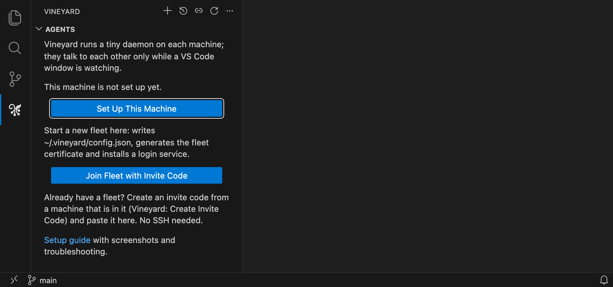
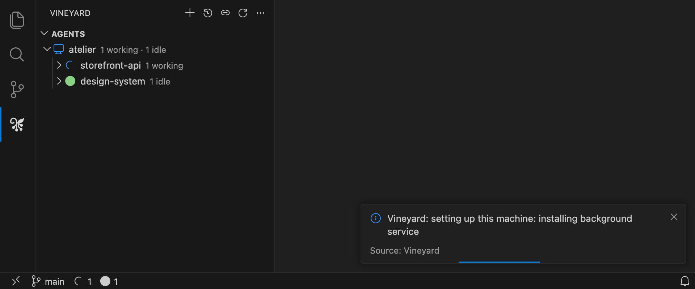
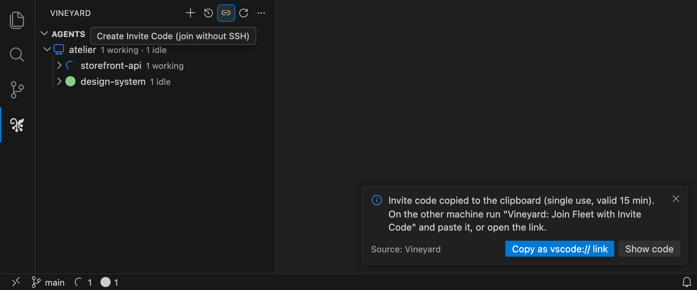
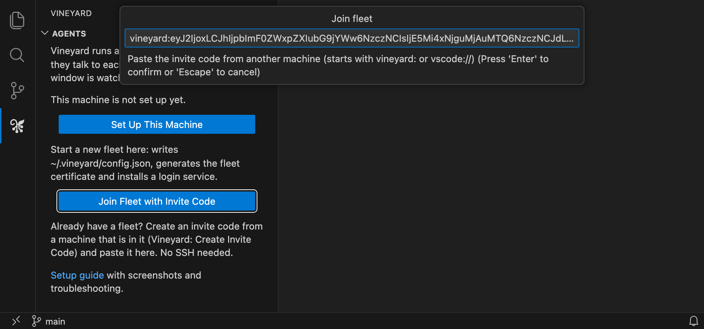
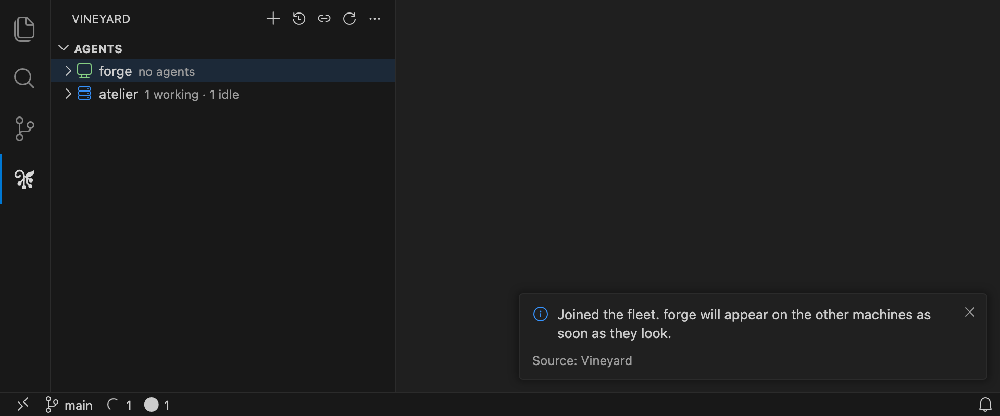
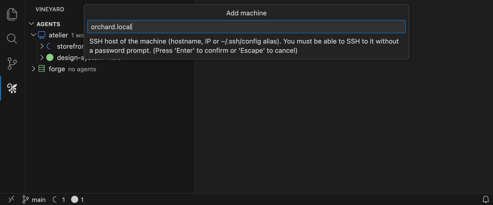
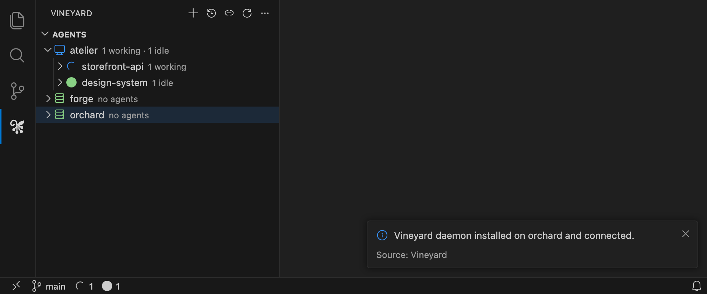

# Setting up a fleet

A **fleet** is every machine whose Vineyard daemon holds the same fleet certificate. You create it
once on the first machine, then bring each further machine in with an **invite code** (no SSH) or
over **SSH**. There is no hub, so any machine can add the next one, and any machine you open VS Code
on can watch all of them.

This guide builds a three-machine fleet from scratch: `atelier`, a Mac where VS Code runs; `forge`,
a Linux box joined with an invite code; and `orchard`, a server added over SSH. *(All names and
screenshots here are made up.)*

* [Before you start](#before-you-start)
* [1. Set up the first machine](#1-set-up-the-first-machine)
* [2a. Join a machine with an invite code](#2a-join-a-machine-with-an-invite-code)
* [2b. Add a machine over SSH](#2b-add-a-machine-over-ssh)
* [3. Check the fleet](#3-check-the-fleet)
* [Networks, addresses and ports](#networks-addresses-and-ports)
* [Removing, leaving and rejoining](#removing-leaving-and-rejoining)
* [Troubleshooting](#troubleshooting)
* [What gets installed where](#what-gets-installed-where)

## Before you start

**On every machine**

* Claude Code installed and signed in. A machine without it still joins and shows up as *no Claude
  Code*, and you can sign it in later with *Sign In to Claude on Machine…* from its right-click menu.
* macOS, Linux or Windows on arm64 or x64. The extension bundles a daemon for each; see [Known
  gaps](../README.md#known-gaps) for how well tested Windows is.

**On the machines you will sit at**

* VS Code with the **Vineyard** extension from the Marketplace. A machine you only add over SSH
  needs neither VS Code nor the extension.

**Between the machines**

* TCP on the daemon port, **7734** by default, must be reachable **from each machine you watch from
  to every other machine**. For an invite, the joining machine also needs to reach the inviting one.
  Daemons only ever connect to each other, never to anything outside your fleet.
* Every machine uses the same port. To use a different one, change `vineyard.daemon.port` in VS
  Code settings **before** setting up the first machine.

## 1. Set up the first machine

Open the Vineyard icon in the Activity Bar. On a machine that is not in a fleet yet, the view offers
two buttons. Choose **Set Up This Machine**.

<p align="center"></p>

This takes a few seconds and does three things:

1. **Writes `~/.vineyard/config.json`.** The machine id is the lowercase hostname (`atelier.local`),
   the display name is its first label (`atelier`), and the address other machines should dial is
   `<hostname>:7734`.
2. **Generates the fleet certificate** (`fleet.crt` and `fleet.key` in `~/.vineyard`). This one
   certificate *is* the fleet: every member holds a copy, and holding `fleet.key` is what lets a
   machine in. Treat it like a private key.
3. **Installs the daemon as a login service** so it starts with your session: a launchd agent on
   macOS, a systemd user unit on Linux, a logon scheduled task on Windows.

<p align="center"></p>

Your local agents appear within a second. The Vineyard output channel opens alongside and shows each
step; if anything fails, the reason is there.

> **Linux:** the daemon runs as a systemd *user* unit, which normally starts at login. If you want it
> running after a reboot before anyone logs in, run `loginctl enable-linger` once. The installer
> reminds you when it is off.

## 2a. Join a machine with an invite code

Use this for any machine where you can run VS Code: laptops, Windows machines without an SSH
server, or machines where you do not have key-based SSH set up.

**On a machine already in the fleet** (here `atelier`), click the **link icon** in the Vineyard view's
toolbar, or run **Vineyard: Create Invite Code** from the Command Palette.

<p align="center"></p>

The code is already on your clipboard. Get it to the other machine however suits you: a password
manager, a chat to yourself, or by typing it off the screen with **Show code**. **Copy as vscode://
link** gives you a link that opens VS Code on the other machine and fills the code in for you.

An invite code:

* works **once** and expires after **15 minutes**;
* carries the inviting machine's addresses (its advertised name and its LAN IPs), a fingerprint of
  the fleet certificate so the joiner cannot be tricked into joining an impostor, and a random token;
* is, until it is used, as good as the fleet key. Send it the way you would send a password.

**On the new machine** (here `forge`), install the extension, open the Vineyard view and choose
**Join Fleet with Invite Code** (or run it from the Command Palette, or open the `vscode://` link).
Paste the code and press Enter.

<p align="center"></p>

The new machine dials the inviter, checks its certificate against the fingerprint in the code,
presents the token, and receives the fleet certificate and the list of known machines. It then writes
its own config and installs its own service, just as in step 1. The inviting machine only needs its
daemon running; its VS Code window can be closed.

<p align="center"></p>

Because the new machine's Vineyard view is open, its daemon immediately connects to every machine it
was told about and introduces itself, so it appears in their views too.

> **A machine that is already in a fleet** can join another one. You will be asked to confirm,
> because joining replaces its certificate and its list of machines.

### Joining without VS Code

A headless machine you cannot SSH to can still join with the standalone daemon. Download the
`vineyardd-<os>-<arch>` binary for it from the
[Releases page](https://github.com/peter-dolkens/vineyard/releases) (check it against
`SHA256SUMS.txt`), create an invite code on a member, then on the new machine:

```sh
chmod +x vineyardd-linux-amd64
./vineyardd-linux-amd64 join 'vineyard:eyJ2Ijox…'   # the invite code
./vineyardd-linux-amd64 install                     # copies itself to ~/.vineyard/bin and starts
```

`join` accepts `--name`, `--machine-id`, `--port` and `--advertise` if the defaults (hostname, 7734)
are wrong for this machine. The inviter tells every machine it connects to about the newcomer, so
it appears on the others the next time they look.

## 2b. Add a machine over SSH

Use this for servers and boxes you already reach with `ssh` and a key. Nothing needs installing on
the target first.

Click **+** (*Add Machine*) in the Vineyard toolbar and enter the SSH host: a hostname, an IP, an
alias from `~/.ssh/config`, or `user@host`.

<p align="center"></p>

The extension then:

1. detects the target's OS and CPU over SSH and picks the matching bundled daemon;
2. copies the daemon, `fleet.crt` and `fleet.key` into `~/.vineyard` on the target with `scp`;
3. runs `vineyardd init` there with the list of machines this one knows, then `vineyardd install`;
4. adds the target to this machine's list and waits up to 20 seconds for it to connect.

<p align="center"></p>

Requirements and details:

* **SSH must not prompt.** Vineyard runs `ssh` non-interactively, so a password or passphrase prompt
  fails the install. Use a key loaded in your agent, and connect once by hand so the host key is
  already trusted.
* **The machine id is the host exactly as you typed it**, lowercased, and its display name is the
  first label. Type the name you want to see.
* **Windows targets** need the OpenSSH server enabled. If they don't have it, use an invite code
  instead.
* **Macs over SSH:** `launchctl` needs the target user to have a GUI login session. Without one the
  installer falls back to `launchctl load -w`.
* SSH is only used for the install. Once it's done, the daemons talk to each other directly and
  never use SSH, even for [daemon updates](DESIGN.md#staying-up-to-date).

## 3. Check the fleet

Each machine appears in the tree with a live summary (*1 needs you · 2 working*, *no agents*,
*offline · last seen 2h ago*). Hover a machine for its daemon version, OS and address.

From a terminal on any member:

```sh
~/.vineyard/bin/vineyardd status      # the fleet as the local daemon sees it
~/.vineyard/bin/vineyardd peer list   # the machines this one knows and the address it dials
```

Repeat step 2 for each further machine, from whichever machine is convenient.

## Networks, addresses and ports

**How machines find each other.** Each daemon keeps a list of machines and the address it dials for
each, in `~/.vineyard/config.json`. It starts with what setup or the invite told it. Every
connection then also carries the other side's advertised address and LAN IPs plus the address it
was actually seen at, and the daemon keeps whichever address works. A laptop that changes IP
therefore keeps working without anyone editing config. Each machine keeps up to 10 addresses per
member, most recently used first, so one that moves between networks (home, office, VPN) finds its
way back without the list growing forever. The daemon tries them a quarter of a second apart, in that
order, and uses the first that answers.

**Machines tell each other about the rest of the fleet.** The first message on every connection
also lists every other machine the sender knows and how to reach it. So a machine that reaches any
one member learns about all of them, including one added over SSH or joined from the command line
that nobody has ever watched from. The list is sent once per connection and never passed on or
repeated.

**Only the watching machine connects out.** The machine whose VS Code has the Vineyard view open
dials the others. A daemon that nobody is watching holds no connections at all. It still listens on
7734, so it can be watched, invited from, or updated.

**Different networks.** The default advertised address is the hostname, which usually resolves only
on the local network. For machines on different networks, give them a route to each other: a VPN
such as Tailscale or WireGuard is the easy way, and that network's hostname or IP works as an
address. To change what a machine advertises, edit `advertise` in its `~/.vineyard/config.json` and
restart its daemon (`vineyardd restart`, or *Restart Daemon* from its right-click menu). Vineyard
does not relay through a third machine, so a member you cannot reach directly shows its last-known
state only.

**Firewalls.** Allow inbound TCP 7734 to each machine you want to watch. For example, on Ubuntu
`sudo ufw allow 7734/tcp`; on Windows, from an elevated PowerShell,
`New-NetFirewallRule -DisplayName Vineyard -Direction Inbound -Protocol TCP -LocalPort 7734 -Action Allow`.
If the macOS application firewall asks whether `vineyardd` may accept incoming connections, allow it.

**Sleeping machines.** When a watched machine stops answering, its neighbours send it Wake-on-LAN
packets, and a watched Mac is kept awake while you look at it. Both are covered in
[How it works](DESIGN.md#design).

## Removing, leaving and rejoining

* **Remove a machine:** right-click it in the tree, then *Remove Machine*. *Remove* forgets it on
  this machine and stops this machine learning it back from the others, who still list it until you
  remove it there too. *Remove and uninstall daemon* also runs `vineyardd uninstall` on it over SSH.
  Adding it again, or the machine itself connecting, puts it back.
* **Uninstall on a machine itself:** `~/.vineyard/bin/vineyardd uninstall` stops and removes the
  service. Delete `~/.vineyard` as well to remove its config and its copy of the fleet key.
* **Rejoin or move to another fleet:** *Join Fleet with Invite Code* with a code from that fleet. You
  are asked to confirm replacing the current certificate.
* **Revoke a lost machine:** anyone holding `fleet.key` is a member, so a stolen laptop means
  rotating the certificate. Remove `~/.vineyard` everywhere, set up the first machine again, and
  bring the others back in with new invite codes.

## Troubleshooting

Logs are in `~/.vineyard/vineyardd.log` on each machine. *Show Daemon Log* on a machine's
right-click menu opens it (over SSH for remote machines), and the **Vineyard** output channel shows
what the extension did.

#### "could not reach the inviter, or the invite was already used or has expired"

The joining machine tried every address in the code and none answered, or the code was no good.
Create a fresh code (each one works once, for 15 minutes), then check the joining machine can reach
the inviter on port 7734, for example with `nc -vz atelier.local 7734`. If the two machines are on
different networks, see [Different networks](#networks-addresses-and-ports).

#### "Daemon installed on … but it is not reachable at …"

The SSH install worked but the new daemon did not answer on its advertised address within 20
seconds. Usually this is a firewall on the target, or a hostname that does not resolve from here.
Open the port, or set a reachable `advertise` on the target and restart its daemon. The machine
stays in your list and connects as soon as it can.

#### Other machines don't show the new one

A watching machine learns about a new one from any member it connects to that already knows it.
That needs daemon 0.3.21 or later on both; older daemons update themselves the first time a Vineyard
view sees them. If the new machine appears but stays *never seen* or *unreachable*, the watching
machine knows about it but cannot reach it: see the addresses and firewall notes above. As a last
resort, tell a machine about another by hand:

```sh
~/.vineyard/bin/vineyardd peer add orchard.local orchard.local:7734
~/.vineyard/bin/vineyardd restart
```

#### "Set up this machine first so there is a fleet certificate to share"

*Add Machine* and *Create Invite Code* need a machine that is already in a fleet. Run step 1 first,
or join this machine to an existing fleet.

#### A machine shows "offline" or "unreachable"

Hover it to see the last connection error. Check the machine is awake and its daemon is running
(`vineyardd status` on it), and that you can reach its port. Machines that were never reachable
show *never seen*.

## What gets installed where

| Path | What |
| --- | --- |
| `~/.vineyard/config.json` | Machine id, name, listen port, advertised address, known machines, options |
| `~/.vineyard/fleet.crt`, `fleet.key` | The fleet certificate. The key is membership. Both are mode 600 |
| `~/.vineyard/bin/vineyardd` | The daemon (`vineyardd.exe` on Windows) |
| `~/.vineyard/vineyardd.log` | Daemon log |
| `~/.vineyard/cache.json` | Last-known state of other machines, shown while they're offline |
| `~/Library/LaunchAgents/net.dolkens.vineyardd.plist` | macOS login service |
| `~/.config/systemd/user/vineyardd.service` | Linux login service |
| Scheduled task **Vineyard** | Windows logon service |

Set `VINEYARD_DIR` to use a directory other than `~/.vineyard`. The daemon's full command set
(`init`, `join`, `invite`, `peer`, `install`, `status` …) is listed by `vineyardd help`, and
[How it works](DESIGN.md) covers the protocol and security model in depth.
